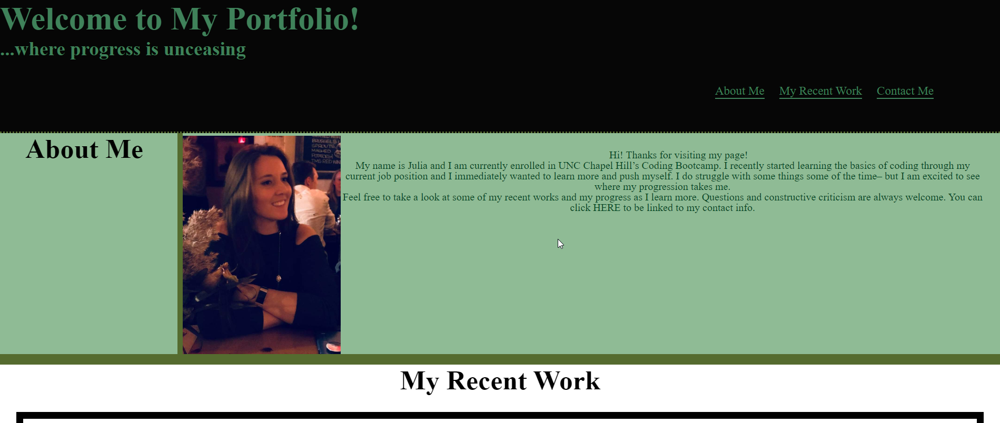

# <a href="https://jjohnson673.github.io/Portfolio/" target="_blank">Julia's Portfolio</a>

## Description

This main webpage was designed as a part of a Challenge for Module 2. Creating the start of our portfolio we were to implement some psuedo elements and changing the layout of the page when viewing on different screen sizes. This challenge was quite daunting and I started from scratch multiple times. It really served as a good eye opener for me on what segements I have the most trouble on and where to focus my efforts to.

## Installation

N/A

## Usage

Within this page you will be able to find some back information on myself along with my linked work. At the moment, there is only 1 completed page, but more will be coming in the near future. All of my contact information is also linked by the footer 

## Credits

N/A

## License

N/A
